# Классификация эхолокационных сигналов летучих мышей

Проект посвящён классификации видов летучих мышей по коротким ультразвуковым WAV-записям. Данные взяты из локальной подвыборки `cleaned_subset_200`: 5116 записей, 26 классов, train/validation split 85/15 со стратификацией по виду. Основная метрика - `macro-F1`, потому что качество по редким и акустически похожим видам важнее, чем только общая accuracy.

Лучший результат проекта на validation: **ResNet18, macro-F1 0.818**. Лучший собственный Transformer-пайплайн: **ViT + Learnable Fourier PE + SSL pretrain + MixUp, macro-F1 0.753**.

## Актуальность

Автоматическая классификация летучих мышей - это прикладная задача для биоакустического мониторинга: летучие мыши активны ночью, быстро перемещаются и почти недоступны для визуального наблюдения, поэтому один из основных неинвазивных способов мониторинга - запись ультразвуковых эхолокационных сигналов и последующее определение вида.

В литературе описывают несколько причин, почему эта задача важна:

- Летучие мыши выполняют важные экологические функции: контроль численности насекомых, опыление, распространение семян. В NABat ML отдельно подчёркивается, что многие популяции подвержены исчезнавению из-за синдрома белого носа, ветряных турбин, изменения климата и потери местообитаний, а базовой информации о распространении и динамике видов всё ещё не хватает ([Khalighifar et al., 2022](https://doi.org/10.1111/1365-2664.14280)).
- Акустический мониторинг масштабируется лучше ручных наблюдений: датчики можно ставить на большие территории и собирать большие объёмы данных. Но затем появляется узкое место - часы записей нужно разметить и проверить. В NABat ML данные вручную размечали эксперты и волонтёры; именно поэтому авторы развивали автоматизированную, воспроизводимую CNN-систему для обработки акустических данных NABat ([Khalighifar et al., 2022](https://doi.org/10.1111/1365-2664.14280)).
- Современные системы должны быть не только точными, но и доступными. В BSG-BATS отмечается, что многие инструменты для определения видов закрытые, регионально ограниченные или плохо масштабируются; это мешает совместной разметке и интеграции данных из разных проектов ([Meramo et al., 2025](https://doi.org/10.1111/2041-210x.70220)).
- Сигналы летучих мышей сложны для классификации: высокая внутривидовая вариативность, похожие виды, наложение сигналов, шум и недостаток размеченных данных ([Fundel et al., 2023](https://arxiv.org/abs/2309.11218)).
- В биоакустике часто мало размеченных данных, поэтому self-supervised learning и transfer learning рассматриваются как способы использовать неразмеченные записи и уменьшить стоимость разметки. В работах по SSL для биоакустики подчёркивается, что данные шумные и часто ограничены по объёму, а их разметка экспертами стоит очень дорого ([Sarkar & Magimai-Doss, 2025](https://arxiv.org/abs/2501.05987), [Liang et al., 2024](https://arxiv.org/abs/2409.09647)).

Отдельная часть проекта связана с позиционным кодированием в Transformer. У механизма внимания нет встроенного знания о порядке и координатах токенов, поэтому для спектрограмм важно явно задавать положение патча по времени и частоте. В статье *Learnable Fourier Features for Multi-Dimensional Spatial Positional Encoding* предложено обучаемое фурье-кодирование для многомерных координат: вместо фиксированного позиционного вектора координаты проходят через обучаемое фурье-преобразование и небольшой MLP. Авторы показывают, что такой подход лучше передаёт пространственные отношения между токенами, повышает качество и ускоряет сходимость по сравнению с рядом других способов позиционного кодирования ([Li et al., 2021](https://arxiv.org/abs/2106.02795)). В этом проекте эта идея проверялась на частотно-временной сетке log-STFT спектрограмм.

## Данные и общий протокол

Используется подвыборка из 200 аудиозаписей для каждого класса из датасета NABat ML:

- 26 классов: 25 видов + `NOISE`;
- 5116 WAV-файлов;
- train: 4348 записей;
- validation: 768 записей;
- split: 85/15, `random_state=42`, `stratify=label`;
- основная метрика: `macro-F1`;
- дополнительные метрики: weighted-F1, balanced accuracy, accuracy.

Для train используется `WeightedRandomSampler`, чтобы классы с меньшим числом записей не терялись в батчах. На validation всегда используется центральный crop без аугментаций.

Аугментации применялись только на train. Для моделей на log-STFT использовались случайный gain jitter исходного waveform и SpecAugment: маски по частоте и времени уже на спектрограмме. Для BEATs аугментация была мягче: использовался тот же 2-секундный crop и небольшое изменение громкости, без SpecAugment на filter bank. Это важное ограничение сравнения: исключение маскировани при аугментации могло помочь BEATs сохранить признаки предобученного encoder-а, но сама по себе не объясняет весь разрыв, потому что одновременно отличаются frontend, предобучение и архитектура. Отдельно проверялся MixUp на этапе fine-tune ViT: он смешивал пары спектрограмм и soft-labels и оказался самой полезной регуляризацией для собственного Transformer-пайплайна.

## График экспериментов

### 1. Предобработка аудио

Предобработка для log-STFT моделей была взята как практическая адаптация подхода NABat ML. В NABat ML авторы детектируют импульсы в WAV-записях, считают FFT/STFT, фильтруют диапазон 5-100 kHz, превращают фрагменты в спектрограммы и подают изображения в CNN ([Khalighifar et al., 2022](https://doi.org/10.1111/1365-2664.14280)). В текущей работе записи уже нарезаны как отдельные WAV-файлы, поэтому вместо детекции отдельных 50-ms импульсов берётся 2-секундный фрагмент записи.

Адаптированный pipeline:

1. WAV приводится к mono.
2. Частота дискретизации приводится к 192 kHz.
3. Из записи берётся 2-секундный фрагмент.
   - train: random crop или energy-biased crop с вероятностью 0.7;
   - validation: center crop.
4. Считается STFT: `n_fft=2048`, `hop_length=512`.
5. Оставляется ультразвуковая полоса 5-96 kHz.
6. Берётся `log1p(abs(STFT))`.
7. Спектрограмма интерполируется к 128x256.
8. Нормализация по каждому примеру.
9. Для train: SpecAugment по частоте/времени и jitter громкости; для validation эти шаги отключены.

### 2. Supervised baseline: CNN

Первым baseline была компактная CNN на log-STFT. Это близко к классическому подходу: спектрограмма рассматривается как изображение, а свёртки ловят локальные частотно-временные паттерны.

Ноутбук: `supervised_cnn_baseline.ipynb`.

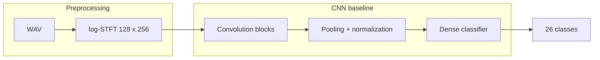

### 3. Supervised baseline: ResNet18

ResNet18 использует тот же log-STFT frontend, но даёт более сильный image-like baseline. В отличие от BEATs, модель не получает внешнее аудио-предобучение: она учится на целевых спектрограммах с нуля.

Ноутбук: `supervised_resnet_baseline.ipynb`.

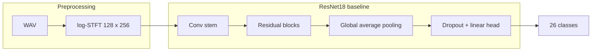

### 4. Transfer learning: BEATs

BEATs оказался сильным внешним аудио baseline. Для ультразвукового ввода использовался uniform filter bank на исходных 192 kHz: STFT, усреднение по 128 равномерным частотным полосам, затем encoder BEATs_iter3. В отличие от log-STFT моделей, временная ось не ужималась до 256 кадров.

Ноутбук: `beats_ultrasound_bat_baseline.ipynb`.

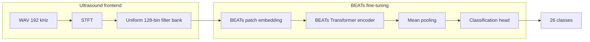

### 5. Абляции BEATs

После основного BEATs baseline проверялись стратегии transfer learning:

- заморозить весь BEATs и обучать только head;
- разморозить последние 4 transformer-слоя;
- заменить 2-секундный клип на 1-секундный.

Эти эксперименты нужны были, чтобы понять, что именно даёт качество BEATs: готовый encoder как feature extractor или полный fine-tune. Результат оказался однозначным: полный fine-tune на 2-секундном клипе лучше.

### 6. Supervised positional encoding: LFPE vs sin/cos

Перед интерпретацией SSL-результатов была сделана проверка: два ViT с одинаковой архитектурой и без SSL pretrain, но с разным positional encoding.

- `vit_sincos_bat_supervised_baseline.ipynb`: fixed 2D sin/cos PE;
- `vit_lfpe_bat_supervised_baseline.ipynb`: learnable Fourier positional encoding.

Это сравнение не отвечает на вопрос про SSL, но показывает, что LFPE не хуже фиксированной sin/cos позиции в supervised-only режиме.

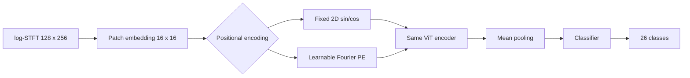

### 7. Собственный ViT: LFPE + SSL MAE

Основной исследовательский контур проекта - компактный ViT с Learnable Fourier positional encoding и self-supervised pretraining через masked autoencoding.

Pretrain:

- вход: log-STFT 128x256;
- patch size: 16x16;
- encoder: 8 transformer-блоков, hidden dim 256;
- decoder: 4 transformer-блока;
- masking: signal-aware, маскируются только high-energy patches; нижние 25% патчей по энергии считаются фоном/шумом и не входят в reconstruction loss;
- loss: MSE по замаскированным патчам.

Fine-tune:

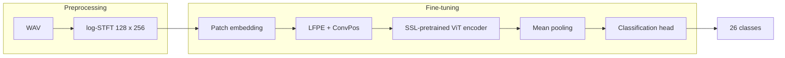

### 8. Абляции ViT

После базового fine-tune проверялись:

- LFPE + SSL без регуляризации;
- MixUp;
- distillation от ResNet18;
- CNN + ViT hybrid;
- distillation + MixUp;
- mean vs mean+max pooling;

Лучший вариант собственного Transformer-пайплайна: `vit_lfpe_bat_ablation_mixup_reg.ipynb`, macro-F1 0.753.

## Результаты

### Основные модели

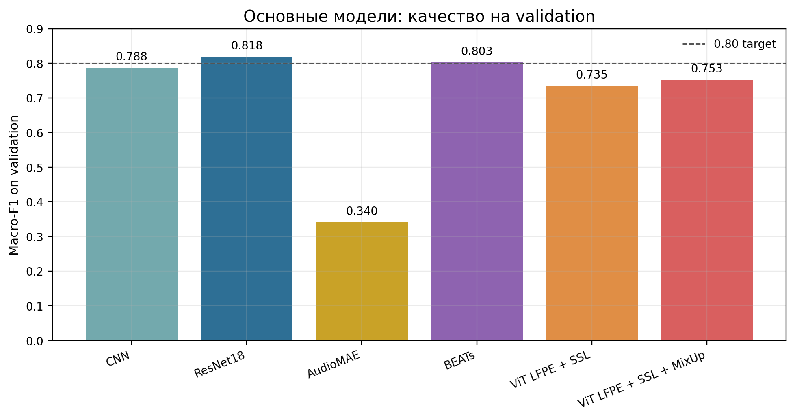

Главный результат: ResNet18 остаётся лучшей моделью проекта (`macro-F1=0.818`, `checkpoints/resnet18_bat_best.pt`). BEATs почти догоняет его (`0.803`, `checkpoints/beats_bat_finetune_best.pt`), а лучший собственный Transformer-пайплайн — `ViT LFPE + SSL + MixUp` (`0.753`, `checkpoints/vit_lfpe_bat_ablation_8_mixup_reg_best.pt`).

На графике ниже показана динамика validation macro-F1 по эпохам. Это те же ключевые scalar-метрики, которые логировались в ClearML, сохранённые отдельно в воспроизводимом виде.

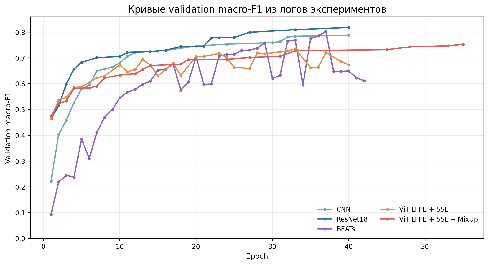

### BEATs ablations

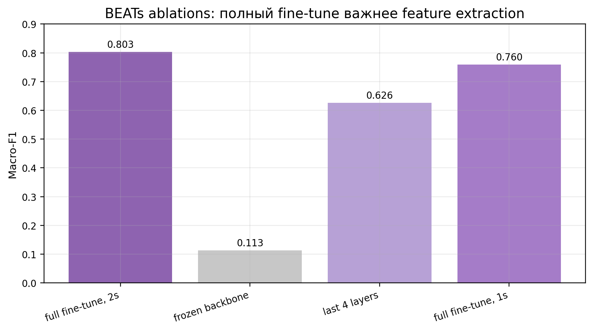

Для BEATs важен именно полный fine-tune encoder-а. Замороженный backbone почти не переносится на ультразвуковую задачу (`macro-F1=0.113`), а разморозка только последних четырёх слоёв даёт заметно худший результат (`0.626`). Сокращение клипа до 1 секунды тоже ухудшает качество (`0.760` против `0.803`), значит, 2-секундный контекст здесь полезен.

### ViT ablations

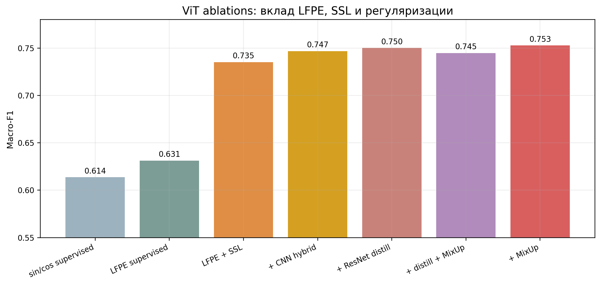

У ViT видно два главных эффекта. Первый: LFPE в supervised-only сравнении немного лучше fixed sin/cos (`0.631` против `0.614`), поэтому дальше эксперименты велись с LFPE. Второй: основной скачок даёт SSL pretrain (`0.631 -> 0.735`), а лучший дополнительный прирост даёт MixUp (`0.753`). CNN-ветка и distillation от ResNet18 тоже улучшают базовый ViT, но не сильнее обычного MixUp.

## Обсуждение результатов

### CNN и ResNet оказались сильнее Transformer

Лучший результат проекта даёт ResNet18, а не Transformer. Спектрограмма эхолокации - это изображение с локальными частотно-временными структурами: наклонные FM-треки, узкие пики, гармоники, короткие импульсы. CNN хорошо подходит под такие признаки: локальные фильтры сразу видят форму импульса и её небольшие сдвиги по времени/частоте.

ViT устроен иначе. Он режет спектрограмму на патчи и обрабатывает их как последовательность токенов. Такой подход гибче, но требует больше данных или более сильного pretraining. В этом проекте train split содержит 4348 записей - для небольшого CNN/ResNet этого достаточно, а для Transformer это мало. Поэтому supervised-only ViT оказался слабым: LFPE без SSL дал 0.631, sin/cos без SSL - 0.614.

SSL pretraining резко улучшил ViT: 0.631 -> 0.735. Это главный результат текущего проекта, так как подтверждает гипотезу, что использование ssl улучшает модель Transformer. Но стоит учитывать, что MAE pretraining учит восстанавливать замаскированные патчи, а не напрямую разделять близкие виды, поэтому улучшилось именно извлечение признаков.

MixUp дал лучший ViT результат: 0.753. Это согласуется с графиками: validation loss у MixUp ниже и стабильнее, чем у базового ViT. Но прирост ограниченный: модель всё ещё уступает CNN A0, BEATs и ResNet18.

### Что показало сравнение LFPE и sin/cos

Сравнение supervised-only вариантов показало:

- fixed sin/cos PE: 0.614;
- LFPE: 0.631.

Learnable Fourier PE в этой задаче дал небольшой плюс даже без SSL. Но основной прирост всё равно связан не только с positional encoding, а с pretraining: LFPE + SSL дал 0.735.

Можно сделать вывод, что LFPE помогает как часть Transformer-пайплайна и немного превосходит fixed sin/cos в supervised-only контроле, но главный вклад в качество ViT внёс SSL pretrain и последующая регуляризация.

### Почему BEATs не стал лучшей моделью

BEATs предобучен на широком аудио-домене и хорошо переносится на биоакустику, что согласуется с работами о transfer learning и SSL в bioacoustics. Но домен всё равно другой: AudioSet и похожие аудио-датасеты в основном лежат в слышимом диапазоне, а эхолокация летучих мышей занимает ультразвук.

Диагностика по BEATs показала связь качества с частотным диапазоном вида:

- больше энергии в 5-20 kHz связано с более высоким F1;
- выше spectral centroid - ниже F1;
- больше энергии выше 50 kHz - ниже F1.

Это хорошо объясняет domain gap: виды, чьи сигналы ближе к обычному аудио, BEATs узнаёт лучше.

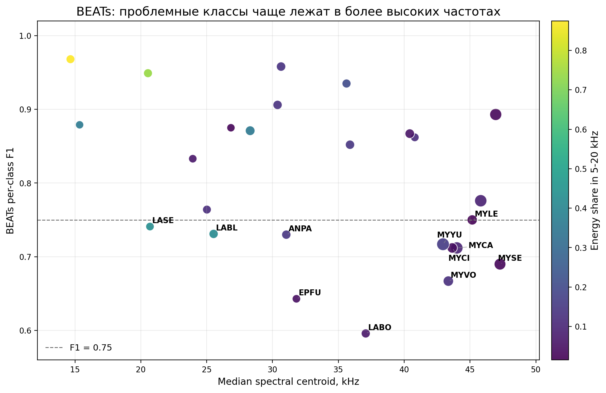

### Где модели ошибались

У лучшего ViT + SSL + MixUp слабее всего остаются классы:

| Вид | F1 | Комментарий |
| --- | ---: | --- |
| MYCA | 0.50 | часто путается внутри группы Myotis |
| MYVO | 0.54 | близок к MYCI по частотным характеристикам |
| MYYU | 0.58 | похожие частоты с MYCA/MYVO, нестабильный recall |
| EPFU | 0.58 | часть ошибок уходит в ANPA и соседние классы |
| MYSE | 0.60 | часто пересекается с MYLE/MYTH по форме сигнала |
| ANPA, LABO | 0.62 | смешение с близкими low/mid-frequency паттернами |

Сильные классы: EUMA, LAIN, LASE, NYMA, MYEV. У них либо более характерная форма спектрограммы, либо меньше пересечение с соседними видами в текущем validation split.

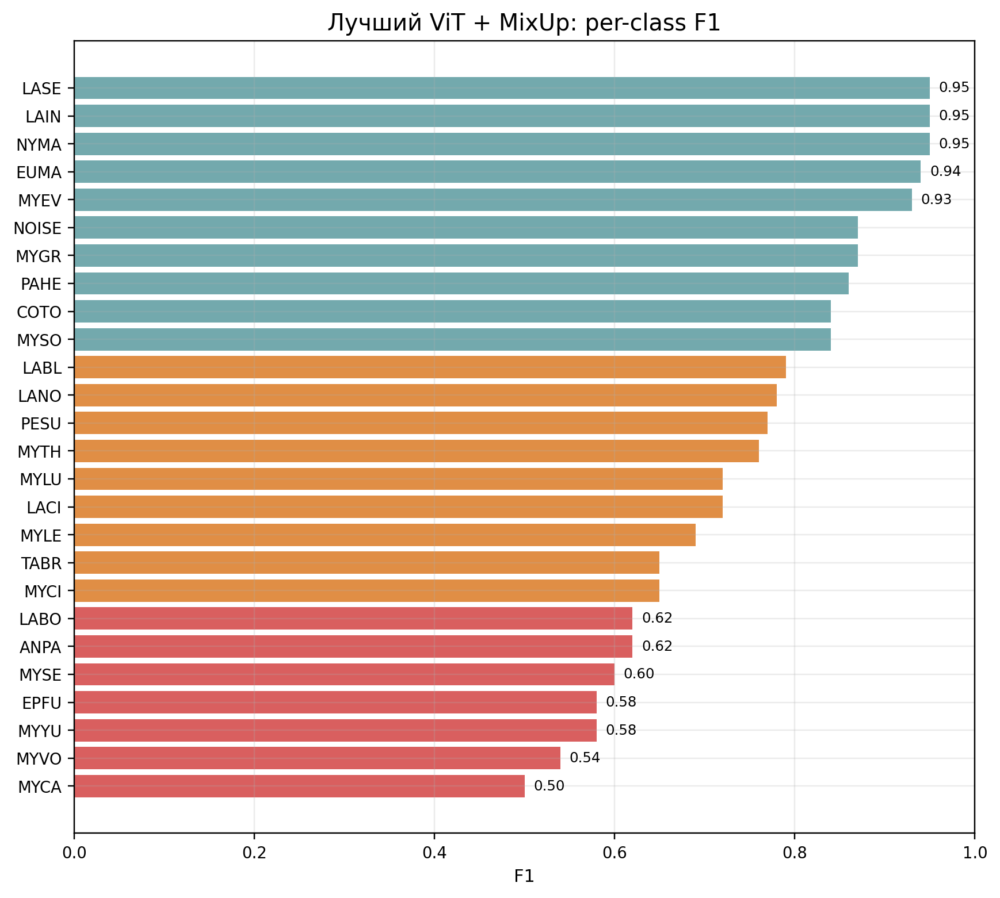

Основные причины ошибок:

1. **Похожие виды.** Некоторые пары имеют близкие spectral centroid и похожую форму импульса. В 2-секундном окне модель видит не один идеальный call, а смесь импульсов, фона и тишины.
2. **Недостаток данных для Transformer.** 4348 train-записей мало для ViT без сильного внешнего предобучения.
3. **Фоновый шум нельзя просто включить в loss.** Попытки маскировать фоновые патчи ухудшали MAE: модель начинала учить восстановление шума вместо полезных эхолокационных участков.
4. **Короткий контекст.** 2 секунды достаточно для многих записей, но не всегда содержит одинаково информативные импульсы для всех видов.

## Итог

Проект не привёл к модели, которая обгоняет ResNet18 или BEATs, но по проделанной работе можно сделать следующие выводы:

- сильный CNN/ResNet baseline остаётся лучшим для этой выборки;
- BEATs хорошо переносится, но ограничен domain gap между обычным аудио и ультразвуком;
- собственный ViT без SSL слабый;
- LFPE немного лучше fixed sin/cos в supervised-only контроле;
- SSL pretraining существенно улучшает ViT;
- MixUp даёт лучший собственный Transformer результат.

В результате, для малой выборки ультразвуковых спектрограмм CNN-индуктивный bias оказался сильнее, чем компактный Transformer. Self-supervised pretraining делает ViT заметно лучше, но текущий MAE-pretrain и объём данных недостаточны, чтобы превзойти ResNet18.

## Ссылки

- Khalighifar et al., [NABat ML: automated, scalable solutions for documenting North American bat populations](https://doi.org/10.1111/1365-2664.14280)
- Meramo et al., [BSG-BATS: open-source data annotation portal and classifier for European bat vocalizations](https://doi.org/10.1111/2041-210x.70220)
- Fundel et al., [Automatic Bat Call Classification using Transformer Networks](https://arxiv.org/abs/2309.11218)
- Li et al., [Learnable Fourier Features for Multi-Dimensional Spatial Positional Encoding](https://arxiv.org/abs/2106.02795)
- Chen et al., [BEATs: Audio Pre-Training with Acoustic Tokenizers](https://arxiv.org/abs/2212.09058)
- Sarkar & Magimai-Doss, [Comparing SSL Models Pre-Trained on Human Speech and Animal Vocalizations for Bioacoustics Processing](https://arxiv.org/abs/2501.05987)
- Mahbub et al., [Bat2Web: real-time classification of bat species echolocation signals](https://doi.org/10.3390/s24092899)
