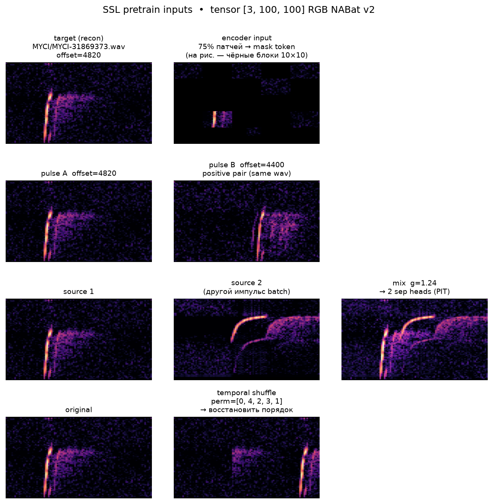

# Сводка результатов (NABat v2, test inference)

Дата: 2026-07-27
Обучение не запускалось — только inference на test split.

**Датасет:** `data/nabat_paper_31/` — split **80/10/10** по **файлам**, `stratify=species`, seed=42 (локальный proxy; holdout из статьи недоступен).

| Split | Файлов | Импульсов (после balance) | CSV |
|-------|--------|---------------------------|-----|
| **Train** | 10 808 | 40 110 | `trainval/pulses_train.csv` |
| **Val** | 1 464 | 5 700 | `trainval/pulses_val.csv` |
| **Test** | 1 306 | 4 560 | `test/pulses_test.csv` |
| **Итого** | 13 578 | 50 370 | 30 классов |

До pulse-balance было **178 736** импульсов; `--balance-pulses` (min per split) → **50 370** (1337 train / 190 val / 152 test на вид, где хватает данных). На **train** дополнительно `WeightedRandomSampler` (равные классы в batch). **Test eval** — без balance, все импульсы holdout as-is.

**Test (этот отчёт):** 1306 файлов → **4560** импульсов, **30** классов  
**NABat official:** `third_party/gottbat_full/prediction/tf-models/m-1`

## Предобработка данных и вход модели

Протокол близок к NABat ML v2 ([Khalighifar et al., 2022](https://doi.org/10.1111/1365-2664.14280); реализация — `bat/data/nabat.py`, порт gottbat). Все модели в таблице ниже получают **один и тот же** кэшированный вход из `spec_cache`.

### Детекция импульсов

1. WAV → mono, **нативная** частота дискретизации `sr`.
2. Скользящие окна **50 ms**, шаг **30 ms**: `50 * (1 - 0.008 * 50)` (параметр gottbat `overlap = 0.008`).
3. Охват записи — до **45 s**.
4. На каждом 50-ms окне (`_process_window` в `bat/data/nabat.py`):
   - STFT: `n_fft = floor(0.001 * sr)` (окно **1 ms**), `win_length = n_fft`, `hop_length = n_fft // 4`, Hamming;
   - `|STFT|²` → dB (`power_to_db`);
   - полосовая маска: bins с `f ≤ 5 kHz` или `f ≥ min(100 kHz, sr/2 - 2 kHz)` → **−500 dB**;
   - **argmax** по матрице → индексы пика; `t_peak_ms = frame_idx / 4`;
   - проверки положения пика (таблица ниже);
   - **median-denoise**: медиана по частоте, затем по времени, `clip(min=0)`;
   - SNR и amplitude на **denoised** спектре.
5. Идентификатор импульса — `offset` (конец 50-ms окна, ms).

### Фильтрация качества (NABat quality filter)

| Проверка | Условие (как в коде) |
|----------|----------------------|
| Пик по времени | **10 ms ≤ t_peak ≤ 40 ms** (20–80 % от 50 ms) |
| Пик по частоте | **5 kHz < f_peak < min(100 kHz, sr/2 − 2 kHz)** |
| SNR | **r_sig / r_other ≥ 7**; `r_other = mean(spec_dB)`; `r_sig = mean` 10 time-бинов `[idx−4 : idx+6]` в строке `f_peak` |
| Амплитуда | **`spec_dB[f_peak, t_peak] ≥ 21 dB`** |

Индекс пика — **до** denoise (band-limited STFT). SNR и amplitude — **после** median-denoise.

### RGB-спектрограмма (supervised / test inference)

1. Median-denoise STFT окна (`Metadata.window`).
2. Рендер `librosa.display.specshow` на чёрный фон **100×100 px** (`figsize=(1,1)`, `dpi=100`).
3. Тензор **`float32 [3, 100, 100]`**, значения **[0, 1]** — вход CNN, ResNet18, ConvNeXt-S, ViT fine-tune и NABat official.
4. Кэш: `spec_cache/`, версия `nabat_v2_f16_100` (float16 на диске, float32 при загрузке).

На **train** для supervised-моделей дополнительно: SpecAugment (time/freq mask, gain jitter). На **test** аугментации отключены.

### Вход SSL pretrain (ViT + SSL)

SSL и fine-tune используют те же RGB-спектрограммы **3×100×100**. Отличия только в задаче:

| Компонент | Когда | Вход | Задача |
|-----------|-------|------|--------|
| **Signal-aware MAE** | каждый batch | **75 %** патчей 10×10 **убраны** → `mask token` в encoder; decoder восстанавливает все | recon + utterance (λ=1.0) |
| **Same-recording contrastive** | каждый 4-й batch | два импульса **одного WAV** | NT-Xent (λ=0.25) |
| **Source separation** | каждый 4-й batch (offset 1) | mix = max(g·s1, s2), g∈[0.7, 1.4] | две sep-головы, PIT (λ=0.5) |
| **Temporal jigsaw** | каждый 4-й batch (offset 2) | **5 полос** перемешаны по времени | восстановить исходный порядок (λ=0.5) |

*Рис. — MAE, contrastive pair, separation mix, temporal jigsaw. Supervised/test — исходная RGB без этих трансформаций.*

Supervised/test получают полную RGB-спектрограмму без маскирования и aux-трансформаций.

### Split и оценка

- **Train / val / test:** 80/10/10 по файлам, stratify по виду (`scripts/build_nabat_paper_dataset.py`).
- **Pulse balance:** min импульсов на вид **внутри каждого split** (не между split'ами).
- **Train:** 10 808 файлов, 40 110 импульсов; **val:** 1 464 / 5 700 (early stopping, выбор чекпоинта).
- **Test:** 1 306 / 4 560 — holdout, метрики ниже только здесь.
- **Pulse-level:** каждый импульс = один пример (как validation в NABat ML).
- **File-level:** mean softmax по импульсам файла → argmax (как test в статье, **без range maps**).

---

## 1. Общие метрики

**Confidence и порог (как в NABat ML, Khalighifar et al., 2022).** После mean softmax по импульсам файла получаем вектор средних вероятностей `mean_prob`; **confidence** = `max(mean_prob)` — уверенность в топ-классе. В промышленном pipeline NABat ML file-level identification — не всегда «угадать класс любой ценой»:

1. **Condition 1 (range maps)** — предсказание отфильтровывают по **географическим картам ареалов**: вид не может быть назначен, если он не встречается в ячейке/сезоне записи. **Здесь range maps не применялись.**
2. **Condition 2 (confidence threshold)** — если `max(mean_prob) < 0.57`, файл помечают **NoID** (no identification): модель «не уверена», вид не присваивают. Порог **0.57** взят из статьи; у нас воспроизведён только этот шаг.

Строки **File-level accuracy / macro-F1 / weighted precision** выше — по **всем** test-файлам с принудительным argmax (даже при низкой уверенности). Строка **File-level + conf ≥ 0.57** — accuracy **только среди файлов с conf ≥ 0.57**; остальные в NoID (см. строку «Отброшено…»). Это ближе к operational metric из статьи, но **без range maps** метрика всё равно не сопоставима с их **92 %** weighted accuracy на полном test (там condition 1 + 2 вместе).

| Метрика | NABat official | CNN | ResNet18 | ConvNeXt-S | ViT + SSL |
|---------|---|---|---|---|---|
| Pulse-level accuracy | 73.4% | 76.6% | 76.4% | 70.1% | 72.9% |
| Pulse-level weighted precision | 78.1% | 77.2% | 77.0% | 70.2% | 73.2% |
| **Pulse-level macro-F1** | 0.700 | 0.767 | 0.764 | 0.699 | 0.728 |
| **File-level accuracy** (mean softmax по импульсам) | 78.6% | 79.7% | 80.6% | 73.0% | 76.2% |
| File-level weighted precision | 81.1% | 81.3% | 81.9% | 74.2% | 77.9% |
| File-level macro-F1 | 0.757 | 0.781 | 0.792 | 0.718 | 0.745 |
| File-level majority vote accuracy | 76.6% | 77.7% | 78.1% | 71.2% | 74.2% |
| File-level + conf ≥ 0.57 | 89.5% | 90.1% | 90.5% | 80.7% | 88.2% |
| Отброшено как NoID (conf < threshold) | 350 файлов | 388 файлов | 425 файлов | 324 файлов | 438 файлов |
| Классов с ≥90% file ID rate | **8 / 30** | **7 / 30** | **8 / 30** | **3 / 30** | **7 / 30** |

---

## 2. Per-class file-level ID rate (mean prob)

| Класс | NABat official | CNN | ResNet18 | ConvNeXt-S | ViT + SSL |
|-------|---|---|---|---|---|
| MYGR | 100.0% (37/37) | 91.9% (34/37) | 94.6% (35/37) | 83.8% (31/37) | 91.9% (34/37) |
| MYEV | 96.3% (52/54) | 88.9% (48/54) | 85.2% (46/54) | 75.9% (41/54) | 90.7% (49/54) |
| LAIN | 95.1% (58/61) | 88.5% (54/61) | 82.0% (50/61) | 77.0% (47/61) | 80.3% (49/61) |
| MYSE | 93.9% (31/33) | 84.8% (28/33) | 84.8% (28/33) | 72.7% (24/33) | 72.7% (24/33) |
| PAHE | 93.3% (42/45) | 97.8% (44/45) | 97.8% (44/45) | 88.9% (40/45) | 97.8% (44/45) |
| MYSO | 92.6% (50/54) | 88.9% (48/54) | 90.7% (49/54) | 85.2% (46/54) | 90.7% (49/54) |
| NYMA | 92.0% (23/25) | 100.0% (25/25) | 100.0% (25/25) | 100.0% (25/25) | 100.0% (25/25) |
| MYCI | 90.5% (38/42) | 73.8% (31/42) | 78.6% (33/42) | 52.4% (22/42) | 57.1% (24/42) |
| PESU | 89.6% (43/48) | 89.6% (43/48) | 91.7% (44/48) | 75.0% (36/48) | 79.2% (38/48) |
| EUMA | 88.2% (30/34) | 79.4% (27/34) | 91.2% (31/34) | 88.2% (30/34) | 82.4% (28/34) |
| MYYU | 87.3% (48/55) | 83.6% (46/55) | 87.3% (48/55) | 83.6% (46/55) | 78.2% (43/55) |
| MYTH | 87.3% (48/55) | 90.9% (50/55) | 89.1% (49/55) | 87.3% (48/55) | 87.3% (48/55) |
| MYCA | 85.7% (48/56) | 78.6% (44/56) | 76.8% (43/56) | 69.6% (39/56) | 82.1% (46/56) |
| LASE | 84.9% (45/53) | 71.7% (38/53) | 77.4% (41/53) | 66.0% (35/53) | 73.6% (39/53) |
| COTO | 83.3% (15/18) | 88.9% (16/18) | 88.9% (16/18) | 83.3% (15/18) | 83.3% (15/18) |
| EPFU | 81.7% (49/60) | 65.0% (39/60) | 78.3% (47/60) | 68.3% (41/60) | 71.7% (43/60) |
| LABL | 81.2% (13/16) | 93.8% (15/16) | 93.8% (15/16) | 87.5% (14/16) | 87.5% (14/16) |
| MYLE | 80.4% (41/51) | 80.4% (41/51) | 80.4% (41/51) | 76.5% (39/51) | 74.5% (38/51) |
| MYAU | 75.0% (6/8) | 75.0% (6/8) | 75.0% (6/8) | 62.5% (5/8) | 75.0% (6/8) |
| MYVE | 75.0% (3/4) | 100.0% (4/4) | 100.0% (4/4) | 100.0% (4/4) | 100.0% (4/4) |
| IDPH | 75.0% (3/4) | 100.0% (4/4) | 75.0% (3/4) | 100.0% (4/4) | 100.0% (4/4) |
| TABR | 74.6% (50/67) | 76.1% (51/67) | 68.7% (46/67) | 76.1% (51/67) | 71.6% (48/67) |
| MYLU | 74.5% (41/55) | 56.4% (31/55) | 63.6% (35/55) | 61.8% (34/55) | 54.5% (30/55) |
| LABO | 70.5% (43/61) | 62.3% (38/61) | 67.2% (41/61) | 52.5% (32/61) | 62.3% (38/61) |
| LACI | 69.3% (52/75) | 82.7% (62/75) | 82.7% (62/75) | 72.0% (54/75) | 76.0% (57/75) |
| MYVO | 64.2% (34/53) | 62.3% (33/53) | 56.6% (30/53) | 56.6% (30/53) | 54.7% (29/53) |
| NYHU | 63.2% (36/57) | 61.4% (35/57) | 57.9% (33/57) | 40.4% (23/57) | 63.2% (36/57) |
| LANO | 50.8% (30/59) | 83.1% (49/59) | 83.1% (49/59) | 76.3% (45/59) | 76.3% (45/59) |
| ANPA | 44.4% (12/27) | 81.5% (22/27) | 88.9% (24/27) | 74.1% (20/27) | 70.4% (19/27) |
| NOISE | 12.8% (5/39) | 89.7% (35/39) | 87.2% (34/39) | 82.1% (32/39) | 74.4% (29/39) |

---

## 3. Главные путаницы (pulse-level, top-5)

### NABat official

- IDPH → EUMA: **60**
- ANPA → EPFU: **49**
- NOISE → MYGR: **46**
- MYVE → MYLU: **44**
- LABL → PESU: **31**

### CNN

- MYLU → MYVE: **31**
- LABL → PESU: **25**
- MYVO → MYLU: **24**
- EPFU → ANPA: **20**
- NYHU → LASE: **20**

### ResNet18

- IDPH → EUMA: **29**
- TABR → LANO: **25**
- MYVO → MYLU: **23**
- LABL → PESU: **21**
- MYLU → MYVE: **20**

### ConvNeXt-S

- IDPH → EUMA: **30**
- MYCA → MYYU: **29**
- NYHU → LASE: **27**
- MYSE → MYLE: **22**
- EPFU → ANPA: **19**

### ViT + SSL

- MYLU → MYVE: **33**
- MYSE → MYLE: **26**
- LASE → NYHU: **25**
- IDPH → EUMA: **24**
- LABL → PAHE: **21**

---

## 4. Итог

| Вопрос | Ответ |
|--------|-------|
| Лучший pulse macro-F1 | **CNN** (0.767) |
| Лучший file accuracy | **ResNet18** (80.6%) |
| Наши модели vs NABat official (file acc) | лучшая `ResNet18` 80.6% vs 78.6% (+2.0%) |

---

## 5. CNN SSL ablation (test)

Дата: 2026-07-29  
Протокол: тот же test split (1306 файлов, 4560 импульсов).

Обучены **7 из 15** пресетов (singles: mae/con/sep/jig; пары: mae+con, mae+sep; full: mae+con+sep+jig). Остальные комбинации — не обучались. Дополнительно: **CNN+mae+mixup** — finetune `mae` с MixUp (α=0.2, как у ViT)

Для SSL предобучения было выбрано 10 эпох для каждой из моделей, для дообучения - 40 (early stop на 8 эпохах без улучшения).

| Метрика | NABat official | CNN | CNN+mae | CNN+mae+mixup | CNN+con | CNN+sep | CNN+jig | CNN+mae+con | CNN+mae+sep | CNN+mae+con+sep+jig |
|---------|---|---|---|---|---|---|---|---|---|---|
| Pulse-level accuracy | 73.4% | 76.6% | 78.5% | **78.8%** | 77.9% | 77.7% | 77.6% | 77.3% | 77.6% | 78.1% |
| Pulse-level weighted precision | 78.1% | 77.2% | 78.7% | **79.2%** | 78.3% | 78.0% | 78.0% | 77.4% | 78.0% | 78.2% |
| **Pulse-level macro-F1** | 0.700 | 0.767 | 0.784 | **0.786** | 0.778 | 0.776 | 0.776 | 0.771 | 0.776 | 0.779 |
| **File-level accuracy** | 78.6% | 79.7% | **82.5%** | 82.4% | 81.6% | 82.2% | 81.4% | 81.2% | 81.1% | 81.0% |
| File-level weighted precision | 81.1% | 81.3% | 83.4% | **83.5%** | 82.9% | 82.7% | 82.3% | 82.4% | 82.2% | 81.5% |
| File-level macro-F1 | 0.757 | 0.781 | **0.813** | **0.813** | 0.803 | 0.810 | 0.801 | 0.797 | 0.799 | 0.802 |
| File-level majority vote accuracy | 76.6% | 77.7% | **80.4%** | 79.8% | 80.2% | 80.3% | 79.5% | 79.2% | 78.6% | 78.9% |
| File-level + conf ≥ 0.57 | 89.5% | 90.1% | 90.9% | 91.7% | **92.0%** | 91.6% | 91.4% | 90.7% | 91.2% | 90.4% |
| Отброшено как NoID (conf < threshold) | 350 | 388 | **354** | 391 | 376 | 380 | 385 | 372 | 378 | 355 |
| Классов с ≥90% file ID rate | 8 / 30 | 7 / 30 | **10 / 30** | **10 / 30** | 9 / 30 | **10 / 30** | 9 / 30 | **11 / 30** | 7 / 30 | **10 / 30** |

### Итог абляции (test)

| Вопрос | Ответ |
|--------|-------|
| Лучший pulse macro-F1 | **CNN+mae+mixup** (0.786, +0.019 vs supervised CNN) |
| Лучший file accuracy | **CNN+mae** (82.5%, +2.8 pp vs CNN); mixup 82.4% (−0.1 pp) |
| Лучший conf ≥ 0.57 | **CNN+con** (92.0%); mixup 91.7% — второй среди mae-вариантов |
| SSL помогает CNN? | Да: все 7 вариантов ≥ CNN по pulse/file F1 |
| Лучший single-task SSL | **mae** (recon+utterance); MixUp при finetune даёт +0.002 pulse F1 |
| Full combo (4 задачи) | 0.779 pulse F1 — хуже лучших singles/pairs |

---

## 6. CNN SSL: сравнение версий (test)

Дата: 2026-08-10  
Протокол: тот же test split (1306 файлов, 4560 импульсов). Inference через `scripts/eval_test_summary.py`; JSON: `checkpoints/test_eval_ssl_versions.json`.

Сравниваются **supervised baseline** и finetune-чекпоинты с разными вариантами SSL pretrain:

| Модель | SSL pretrain | Separation mix |
|--------|--------------|----------------|
| **CNN** | — (supervised) | — |
| **CNN+mae** | v1: UNet decoder | max(g·RGB₁, RGB₂) |
| **CNN+mae_v2** | v2: bottleneck decoder (MAE) | — |
| **CNN+sep** | v1: UNet decoder | max(g·RGB₁, RGB₂) |
| **CNN+sep_v3** | v3: bottleneck + waveform | физическая смесь w₁+w₂ → tensor RGB renderer |

| Метрика | CNN | CNN+mae | CNN+mae_v2 | CNN+sep | CNN+sep_v3 |
|---------|-----|---------|------------|---------|------------|
| Pulse-level accuracy | 76.6% | 78.5% | **78.6%** | 77.7% | 77.7% |
| Pulse-level weighted precision | 77.2% | 78.7% | **78.9%** | 78.0% | 78.0% |
| **Pulse-level macro-F1** | 0.767 | 0.784 | **0.786** | 0.776 | 0.776 |
| **File-level accuracy** | 79.7% | **82.5%** | 82.2% | 82.2% | 81.4% |
| File-level weighted precision | 81.3% | **83.4%** | 82.9% | 82.7% | 82.3% |
| File-level macro-F1 | 0.781 | **0.813** | 0.811 | 0.810 | 0.798 |
| File-level majority vote accuracy | 77.7% | **80.4%** | 80.3% | 80.3% | 79.6% |
| File-level + conf ≥ 0.57 | 90.1% | 90.9% | 91.4% | **91.6%** | 91.2% |
| Отброшено как NoID (conf < threshold) | 388 | 354 | 391 | 380 | 372 |
| Классов с ≥90% file ID rate | 7 / 30 | 10 / 30 | **11 / 30** | 10 / 30 | 8 / 30 |

### Итог по версиям (test)

| Вопрос | Ответ |
|--------|-------|
| Лучший pulse macro-F1 | **CNN+mae_v2** (0.786, +0.019 vs CNN) |
| Лучший file accuracy | **CNN+mae** (82.5%) |
| sep v3 vs sep v1 (pulse F1) | Практически одинаково (0.776 vs 0.776) |
| sep v3 vs sep v1 (file acc) | v3 хуже (−0.8 pp: 81.4% vs 82.2%) |
| Физическая смесь (v3) | Не ухудшила pulse F1 относительно v1, но file-level чуть ниже |

---

## Протокол подсчёта file-level метрик

1. Для каждого WAV: inference на всех импульсах из test split.
2. **Mean probability (file-level accuracy):** для каждого импульса считаем softmax-вектор вероятностей; по всем импульсам файла усредняем эти векторы поэлементно, затем берём argmax. Учитывается не только метка на каждом импульсе, но и насколько модель была уверена.
3. **Majority vote (file-level majority vote accuracy):** на каждом импульсе сначала argmax (жёсткий класс), затем по файлу выбирается **наиболее частый** класс среди импульсов (mode).
4. **Conf ≥ 0.57:** считается только для агрегации **mean probability** — файлы, у которых max усреднённого softmax < 0.57, исключаются как NoID (неидентифицированные); accuracy пересчитывается на оставшихся.